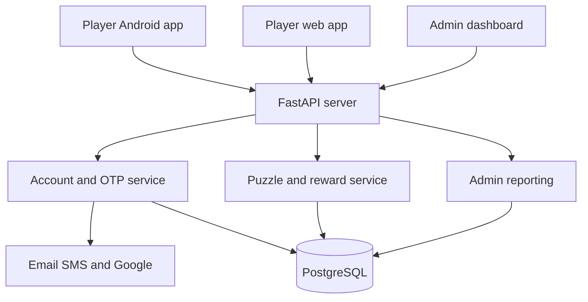
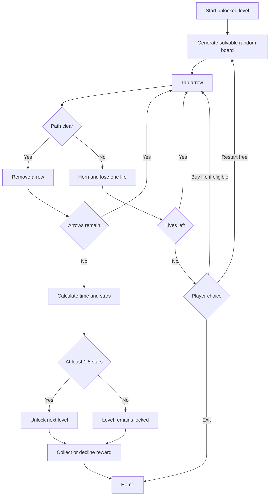
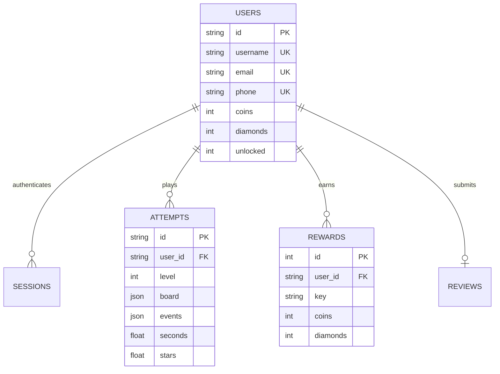

# Architecture diagrams

```mermaid
flowchart TD
  Player[Player Android app] --> API[FastAPI server]
  Browser[Player web app] --> API
  Admin[Admin dashboard] --> API
  API --> Auth[Account and OTP service]
  API --> Game[Puzzle and reward service]
  API --> Reports[Admin reporting]
  Auth --> Providers[Email SMS and Google]
  Auth --> DB[(PostgreSQL)]
  Game --> DB
  Reports --> DB
```

```mermaid
flowchart TD
  Start[Start unlocked level] --> Board[Generate solvable random board]
  Board --> Tap[Tap arrow]
  Tap --> Clear{Path clear}
  Clear -->|Yes| Remove[Remove arrow]
  Clear -->|No| Collision[Horn and lose one life]
  Collision --> Lives{Lives left}
  Lives -->|Yes| Tap
  Lives -->|No| Choice{Player choice}
  Choice -->|Buy life if eligible| Tap
  Choice -->|Restart free| Board
  Choice -->|Exit| Home[Home]
  Remove --> Remaining{Arrows remain}
  Remaining -->|Yes| Tap
  Remaining -->|No| Score[Calculate time and stars]
  Score --> Gate{At least 1.5 stars}
  Gate -->|Yes| Unlock[Unlock next level]
  Gate -->|No| Retry[Level remains locked]
  Unlock --> Reward[Collect or decline reward]
  Retry --> Reward
  Reward --> Home
```

```mermaid
erDiagram
  USERS ||--o{ SESSIONS : authenticates
  USERS ||--o{ ATTEMPTS : plays
  USERS ||--o{ REWARDS : earns
  USERS ||--o| REVIEWS : submits
  USERS {
    string id PK
    string username UK
    string email UK
    string phone UK
    int coins
    int diamonds
    int unlocked
  }
  ATTEMPTS {
    string id PK
    string user_id FK
    int level
    json board
    json events
    float seconds
    float stars
  }
  REWARDS {
    int id PK
    string user_id FK
    string key
    int coins
    int diamonds
  }
```
